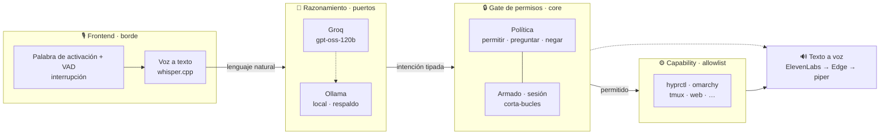
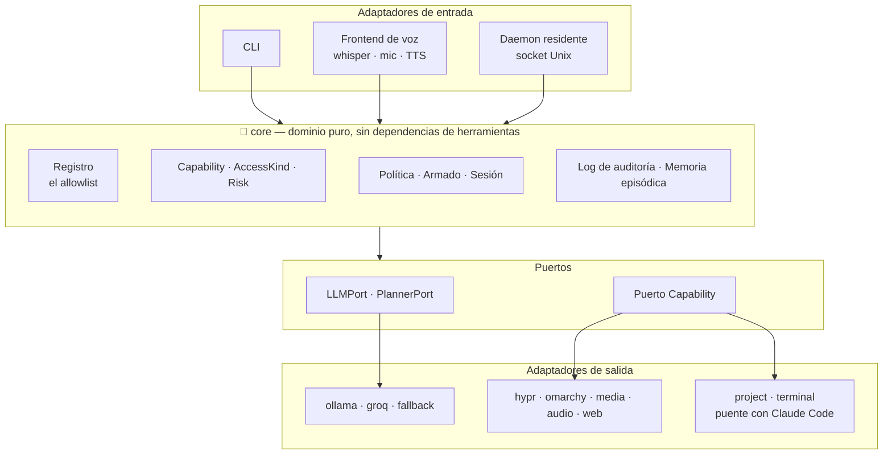
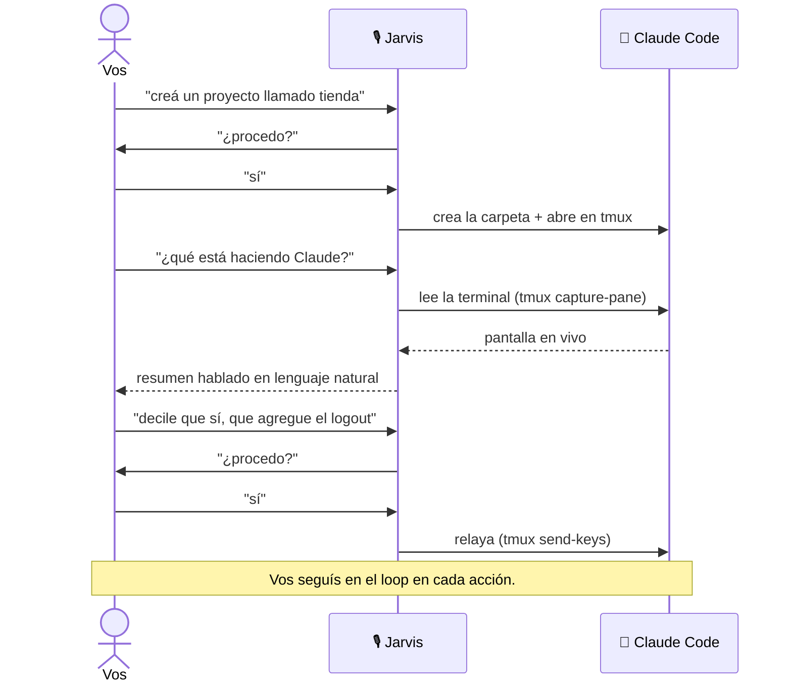

<div align="center">

# 🎙️ hyprvalet

**Un asistente de voz tipado y con permisos para
[Omarchy](https://omarchy.org/) / [Hyprland](https://hypr.land/) — un Jarvis bien hecho.**

[](./LICENSE)
[](https://go.dev/)
[](https://hypr.land/)
[](./docs/DESIGN.md)

[English](./README.md) · **Español**

</div>

---

Decís _"Jarvis"_ al aire y se abre una ventana de conversación. Le pedís que
cambie de workspace, abra apps, ponga un recordatorio, busque en internet, o que
cree un proyecto y abra [Claude Code](https://claude.com/claude-code) ahí — manos
libres, en tu idioma. Razona con un modelo grande en la nube (con respaldo
local), te responde con voz natural, recuerda la conversación, y podés
interrumpirlo hablándole encima.

Y debajo de todo: **el modelo nunca ejecuta un shell.** Solo puede invocar
**capabilities tipadas** de un allowlist explícito — cada una declara qué toca y
qué tan riesgosa es — y las acciones disruptivas preguntan antes de actuar.

## Por qué este diseño

La mayoría de los proyectos "Jarvis" conectan un modelo de lenguaje directo a un
shell y cruzan los dedos. hyprvalet apuesta lo contrario: **el gate es la
frontera de seguridad, nunca el prompt.** Lo que no está registrado como
capability es imposible — no "ojalá bloqueado". Un comando mal entendido no puede
hacer `rm -rf` de tu carpeta personal, porque ninguna capability ejecuta
comandos arbitrarios. Una vez el reconocimiento de voz confundió una pregunta con
una acción, y la capability de bloqueo de pantalla —al ser de confirmación— lo
atajó: el gate tipado hizo su trabajo.

## Cómo funciona

Un pedido hablado atraviesa cuatro etapas. El razonamiento mapea la intención a
una **llamada a una capability tipada** —nunca un string de shell— y el gate de
permisos, no el prompt, decide si se ejecuta.



## Arquitectura

hyprvalet es un sistema **hexagonal** (puertos y adaptadores). El core depende
solo de interfaces pequeñas — no sabe nada de `hyprctl`, del CLI de `omarchy`,
Ollama, Groq, ElevenLabs, whisper ni tmux. Cada herramienta concreta es un
adaptador en el borde, intercambiable sin tocar el core.



Ideas que sostienen el diseño (fundadas al estudiar cinco proyectos de
orquestación de agentes — ver [`docs/SOURCES.md`](./docs/SOURCES.md)):

- **El registro de capabilities tipadas es un allowlist.** Nada fuera de él es
  alcanzable. Cada capability valida sus propios argumentos y devuelve un *error
  correctivo* — que el bucle de razonamiento le re-inyecta al modelo para
  reintentar — en vez de ejecutar con datos malos.
- **Separar el _qué_ del _si_.** El `AccessKind` de una capability (qué toca) es
  distinto de la decisión de si se ejecuta. Lo Safe corre; lo Confirm pregunta
  primero — por voz o teclado, fallando cerrado.
- **Resiliente por composición.** El razonamiento es Groq → Ollama local; la voz
  es ElevenLabs → Edge → piper. Perder la red degrada la calidad, nunca la
  disponibilidad — y la degradación se avisa, nunca es silenciosa.
- **Razona por vos, jamás consiente por vos.** Ver el puente con Claude Code.

## El puente con Claude Code

hyprvalet puede abrir [Claude Code](https://claude.com/claude-code) en un
proyecto, **leer** lo que muestra, y **relayar** por voz tus respuestas — pero
vos aprobás cada acción, y los propios permisos de Claude siguen en pie. El
asistente conversa en tu nombre; nunca consiente en tu nombre.



## Capabilities (25)

| Dominio | Capabilities |
|---|---|
| Workspaces / ventanas | `workspace.switch` · `window.move_to_workspace` · `window.close` · `window.fullscreen` |
| Apps y web | `app.open` · `browser.open` · `music.open` · `web.open` · `web.search` |
| Multimedia y audio | `media.play_pause` · `media.next` · `media.previous` · `volume.set` · `volume.mute` |
| Escritorio | `theme.next` · `theme.set` · `nightlight.toggle` · `screenshot.take` · `system.lock` · `omarchy.run` |
| Asistente | `reminder.set` — recordatorios hablados proactivos |
| Puente con Claude Code | `project.new` · `project.open` · `terminal.read` · `terminal.send` |

Agregar una es simple: implementá la interfaz `core.Capability` en un adaptador y
registrala.

## Inicio rápido

Requiere [Go](https://go.dev/) 1.23+ y una sesión de Hyprland corriendo.

```bash
git clone https://github.com/xebastian153/hyprvalet.git
cd hyprvalet
go build -o hyprvalet ./cmd/hyprvalet

./hyprvalet list                                     # qué puede hacer, y su política
./hyprvalet workspace.switch workspace=3             # correr una capability directo
./hyprvalet do "abrí el navegador y volvé al workspace 2"   # razonar → confirmar → correr
```

El razonamiento usa Ollama local de fábrica (`HYPRVALET_MODEL`, por defecto
`qwen2.5:7b`). Poné `GROQ_API_KEY` para usar un modelo grande en la nube
(`openai/gpt-oss-120b`) con el modelo local como respaldo automático.

### Voz

```bash
./hyprvalet say "hola"        # decir texto (necesita un backend TTS: piper / edge-tts / ElevenLabs)
./hyprvalet voice             # una ventana de conversación manos libres
./hyprvalet listen            # siempre encendido: abre la ventana con la palabra "jarvis"
```

Para la experiencia completa de escritorio — un servicio de palabra de activación
siempre encendido y un atajo `SUPER+A` — mirá las unidades de ejemplo en
[`configs/systemd/`](./configs/systemd/) y el directorio
[`configs/`](./configs/) (política, recetas, cancelación de eco).

### Configuración

Todo se controla por entorno; los secretos viven en un archivo `0600` que leen
las unidades systemd.

| Variable | Para qué |
|---|---|
| `GROQ_API_KEY` · `HYPRVALET_GROQ_MODEL` | razonamiento en la nube — por defecto `openai/gpt-oss-120b` |
| `HYPRVALET_MODEL` | modelo Ollama local — respaldo / offline |
| `HYPRVALET_LANG` | idioma de la salida hablada — `English` / `Spanish` |
| `ELEVENLABS_API_KEY` · `HYPRVALET_VOICE` | voz TTS natural — cae a Edge, luego piper |
| `HYPRVALET_WHISPER_MODEL` · `HYPRVALET_STT_LANG` | reconocimiento de voz — whisper.cpp |
| `HYPRVALET_WAKE_WORD` | palabra de activación + alternativas separadas por coma |
| `HYPRVALET_BARGE_IN` | interrumpir mientras habla — necesita auriculares o cancelación de eco |
| `HYPRVALET_PROJECTS_DIR` | dónde crea `project.new` — por defecto `~/proyectos` |

La política de permisos es un TOML del instalador en
`~/.config/hyprvalet/policy.toml` (ver
[`configs/policy.example.toml`](./configs/policy.example.toml)); una política
rota falla cerrado.

## Estructura del proyecto

```
cmd/hyprvalet/          CLI + frontend de voz
internal/core/          dominio: Capability, AccessKind, Risk, política, auditoría, memoria
internal/protocol/      contrato tipado daemon/cliente
internal/daemon/        daemon residente modelo-actor (socket Unix)
internal/adapters/
  hypr · omarchy · media · audio · web · remind · project · terminal   capabilities
  ollama · groq · fallback · prompt                                    razonamiento
  whisper · mic · tts · elevenlabs · edgetts · speech                  voz
  policyfile · recipefile · eventlog                                   persistencia
docs/DESIGN.md          arquitectura profunda   ·   docs/SOURCES.md   procedencia
```

## Contribuir

Las capabilities nuevas son el lugar más fácil para ayudar: implementá la
interfaz `core.Capability` en un adaptador, validá tus argumentos (devolvé un
error correctivo, no un crash), y registrala. Mantené el core libre de cualquier
dependencia de una herramienta concreta — esa separación es todo el punto.

## Licencia

[MIT](./LICENSE)
