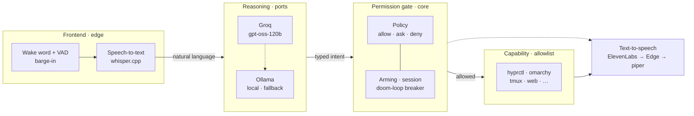
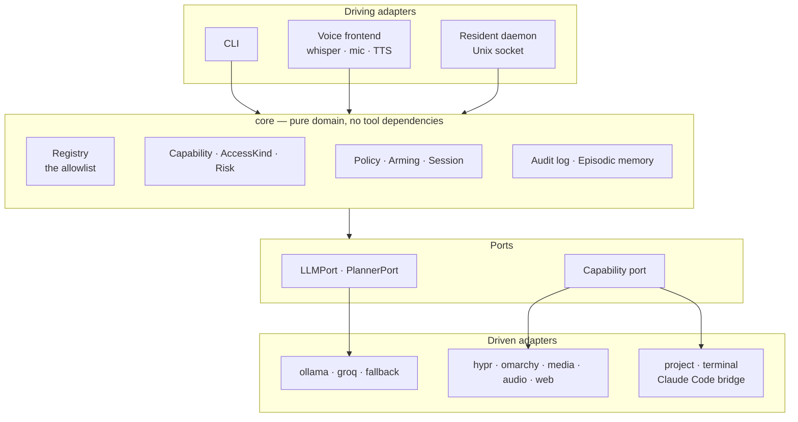
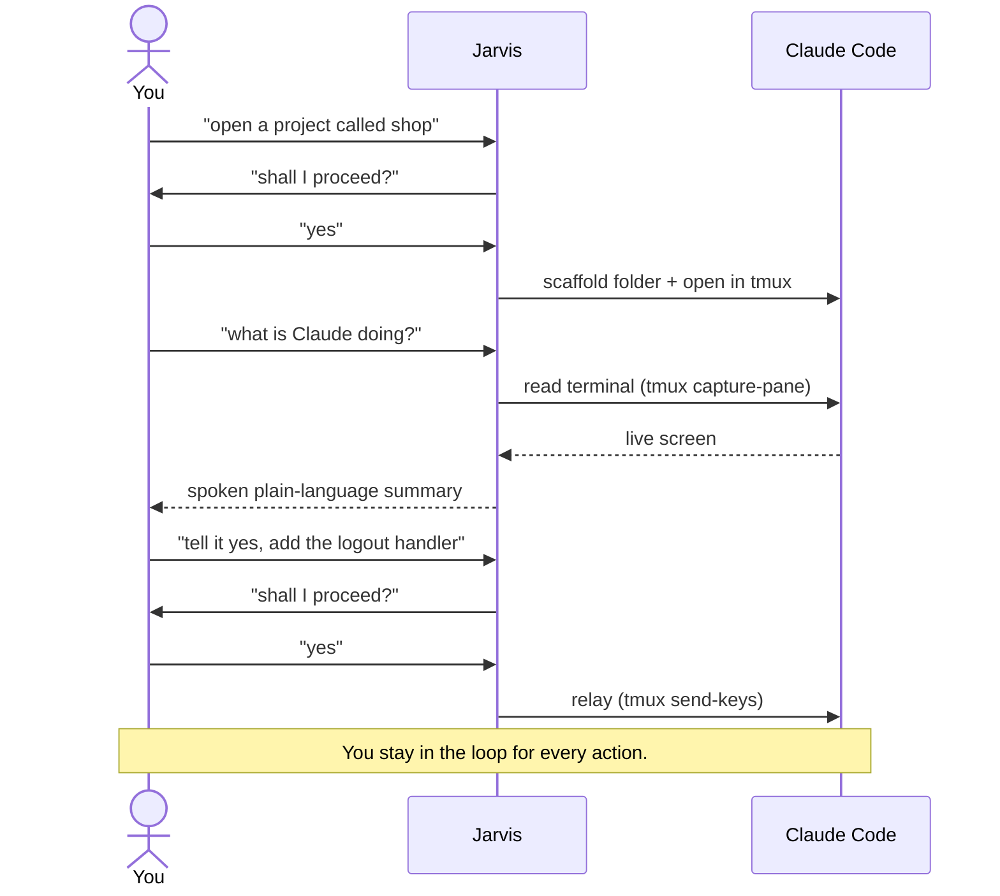

<div align="center">

# 🎙️ hyprvalet

**A typed, permission-gated voice assistant for
[Omarchy](https://omarchy.org/) / [Hyprland](https://hypr.land/) — a Jarvis done right.**

[](./LICENSE)
[](https://go.dev/)
[](https://hypr.land/)
[](./docs/DESIGN.md)

**English** · [Español](./README.es.md)

</div>

---

Say _"Jarvis"_ into the room and a conversation window opens. Ask it to switch
workspaces, open apps, set a reminder, search the web, or scaffold a project and
open [Claude Code](https://claude.com/claude-code) in it — hands-free, in your
own language. It reasons with a large cloud model (local fallback), speaks back
in a natural voice, remembers the conversation, and you can talk over it to
interrupt.

Underneath all of it: **the model never runs a shell.** It can only invoke
**typed capabilities** from an explicit allowlist — each declaring what it
touches and how risky it is — and disruptive actions ask before they act.

## Why this design

Most "Jarvis" projects wire a language model straight to a shell and hope for
the best. hyprvalet takes the opposite bet: **the gate is the safety boundary,
never the prompt.** Anything not registered as a capability is impossible — not
"hopefully blocked". A misheard command cannot `rm -rf` your home directory,
because no capability runs arbitrary commands. When speech recognition once
garbled a question into an action, the screen-lock capability being confirm-tier
caught it — the typed gate did its job.

## How it works

A spoken request flows through four stages. Reasoning maps intent to a **typed
capability call** — never a shell string — and the permission gate, not the
prompt, decides whether it runs.



## Architecture

hyprvalet is a **hexagonal** (ports-and-adapters) system. The core depends only
on small interfaces — it knows nothing about `hyprctl`, the `omarchy` CLI,
Ollama, Groq, ElevenLabs, whisper, or tmux. Every concrete tool is an adapter at
the edge, swappable without touching the core.



Load-bearing ideas (grounded by studying five agent-orchestration projects — see
[`docs/SOURCES.md`](./docs/SOURCES.md)):

- **Typed capability registry as an allowlist.** Nothing outside it is
  reachable. Each capability validates its own arguments and returns a
  *corrective error* — which the reasoning loop feeds back to the model for a
  retry — instead of executing on bad input.
- **Separate _what_ from _if_.** A capability's `AccessKind` (what it touches) is
  distinct from the decision of whether it runs. Safe runs; Confirm asks first —
  by voice or keyboard, failing closed.
- **Resilient by composition.** Reasoning is Groq → local Ollama; voice is
  ElevenLabs → Edge → piper. Losing the network degrades quality, never
  availability — and degradation is announced, never silent.
- **Reasons for you, never consents for you.** See the Claude Code bridge below.

## The Claude Code bridge

hyprvalet can open [Claude Code](https://claude.com/claude-code) in a project,
**read** what it shows, and **relay** your spoken replies to it — but you approve
every action, and Claude's own permission prompts still stand. The assistant
converses on your behalf; it never consents on your behalf.



## Capabilities (28)

| Domain | Capabilities |
|---|---|
| Workspaces / windows | `workspace.switch` · `window.move_to_workspace` · `window.close` · `window.fullscreen` |
| Apps & web | `app.open` · `browser.open` · `music.open` · `web.open` · `web.search` |
| Media & audio | `media.play_pause` · `media.next` · `media.previous` · `volume.set` · `volume.mute` |
| Desktop | `theme.next` · `theme.set` · `nightlight.toggle` · `screenshot.take` · `system.lock` · `omarchy.run` |
| Assistant | `reminder.set` — proactive spoken reminders · `memory.remember` · `memory.recall` · `memory.forget` |
| Claude Code bridge | `project.new` · `project.open` · `terminal.read` · `terminal.send` |

Adding one is small: implement `core.Capability` in an adapter and register it.

## Quickstart

Requires [Go](https://go.dev/) 1.23+ and a running Hyprland session.

```bash
git clone https://github.com/xebastian153/hyprvalet.git
cd hyprvalet
go build -o hyprvalet ./cmd/hyprvalet

./hyprvalet list                                   # what it can do, and its policy
./hyprvalet workspace.switch workspace=3           # run a capability directly
./hyprvalet do "open the browser and go to workspace 2"   # reason → confirm → run
```

Reasoning uses local Ollama out of the box (`HYPRVALET_MODEL`, default
`qwen2.5:7b`). Set `OPENAI_API_KEY` or `GROQ_API_KEY` to use a cloud model;
the providers compose as a resilient chain, OpenAI → Groq → Ollama, so losing
one falls through to the next. (Consumer subscriptions like ChatGPT Plus or
Gemini Advanced are not API access; hyprvalet uses pay-per-token API keys,
which for short spoken commands cost pennies a month.)

### Voice

```bash
./hyprvalet say "hello"       # speak text (needs a TTS backend: piper / edge-tts / ElevenLabs)
./hyprvalet voice             # a hands-free conversation window
./hyprvalet listen            # always-on: opens the window on the wake word ("jarvis")
```

For the full desktop experience — an always-on wake-word service and a `SUPER+A`
keybinding — see the example units in [`configs/systemd/`](./configs/systemd/)
and the [`configs/`](./configs/) directory (policy, recipes, echo cancellation).

### Configuration

Everything is environment-driven; secrets live in a `0600` file read by the
systemd units.

| Variable | Purpose |
|---|---|
| `OPENAI_API_KEY` · `HYPRVALET_OPENAI_MODEL` | cloud reasoning via OpenAI — default `gpt-4o-mini` (cheap; pennies/month for short commands) |
| `GROQ_API_KEY` · `HYPRVALET_GROQ_MODEL` | cloud reasoning via Groq — default `openai/gpt-oss-120b` |
| `HYPRVALET_MODEL` | local Ollama model — fallback / offline |
| `HYPRVALET_LANG` | spoken-output language — `English` / `Spanish` |
| `ELEVENLABS_API_KEY` · `HYPRVALET_VOICE` | natural TTS voice — falls back to Edge, then piper |
| `HYPRVALET_WHISPER_MODEL` · `HYPRVALET_STT_LANG` | speech recognition — whisper.cpp |
| `HYPRVALET_WHISPER_GPU` | pin whisper to a Vulkan device (e.g. an iGPU) so it doesn't contend with the reasoning model; falls back to CPU on failure |
| `HYPRVALET_WAKE_WORD` | wake word + comma-separated alternates |
| `HYPRVALET_BARGE_IN` | interrupt-while-speaking — needs headphones or echo cancellation |
| `HYPRVALET_PROJECTS_DIR` | where `project.new` scaffolds — default `~/proyectos` |
| `HYPRVALET_MEMORY` | long-term memory backend — `engram` (isolated, default when installed) / `jsonl` |

The permission policy is an installer-owned TOML at
`~/.config/hyprvalet/policy.toml` (see
[`configs/policy.example.toml`](./configs/policy.example.toml)); a broken policy
fails closed.

## Project layout

```
cmd/hyprvalet/          CLI + voice frontend
internal/core/          domain: Capability, AccessKind, Risk, policy, audit, memory
internal/protocol/      typed daemon/client contract
internal/daemon/        resident actor-model daemon (Unix socket)
internal/adapters/
  hypr · omarchy · media · audio · web · remind · project · terminal   capabilities
  ollama · groq · fallback · prompt                                    reasoning
  whisper · mic · tts · elevenlabs · edgetts · speech                  voice
  policyfile · recipefile · eventlog                                   persistence
docs/DESIGN.md          deep architecture   ·   docs/SOURCES.md   provenance
```

## Contributing

New capabilities are the easiest place to help: implement the `core.Capability`
interface in an adapter, validate your arguments (return a corrective error, not
a crash), and register it. Keep the core free of any dependency on a specific
tool — that separation is the whole point.

## License

[MIT](./LICENSE)
